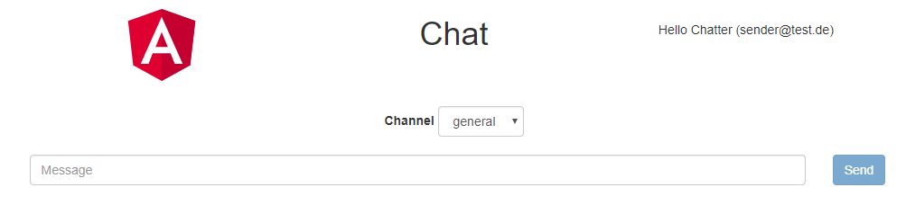

# Tasks


## Task 1 - Clone, build and run the application

### 1.1 Clone / IDE Setup
You can use any IDE you like, e.g. [InteliJ IDEA](https://www.jetbrains.com/idea/download)

#### Automated setup
IDEA: Select: File / New / Project form Version Control / Git

And use the github url: https://github.com/senacor/code-and-play-full-stack/

- Ensure IDEA imported the maven project. If not run *Reimport All Maven Projects*.
- Setup project JDK (Java 8)

#### Manual setup 
Clone or download the repository 'code-and-play-full-stack' from [github.com/senacor](https://github.com/senacor).

    # Use ssh
    git clone git@github.com:senacor/code-and-play-full-stack.git
    
    # or http
    git clone https://github.com/senacor/code-and-play-full-stack.git
     
You are on branch 'master'. 

Import/open the project in your IDE.
 - For IDEA: `File / Open` and select the `pom.xml` in the root of the git repository.
 - For Eclipse: `File / Import`, choose `Existing Maven Project` and select the root folder of the git repository.

For Eclipse users: Make sure you installed the [Kotlin Plugin](http://marketplace.eclipse.org/content/kotlin-plugin-eclipse)

### 1.2 - Build and run it
Build the application with Maven (run Maven install).

    cd services
    mvn clean install

Run the application directly in your IDE.
 - Run the `main` method of class `ChatApplication`.

You should see now the following log entries:
    
    Tomcat started on port(s): 8080 (http) with context path ''
    Started ChatApplication in 3.913 seconds (JVM running for 4.447)

Call [http://localhost:8080/api/channels](http://localhost:8080/api/channels) to get an response from the channel REST endpoint.
    
Best for checking your REST endpoints is a REST client (e.g. [Postman](https://www.getpostman.com/)). 
Or just use [curl](https://curl.haxx.se/) (it's also included in Windows Git Bash).

```
curl http://localhost:8080/api/channels
```
```
# expected result 
[{"channelId":"general","name":"general"},{"channelId":"dev","name":"dev"},{"channelId":"humor","name":"humor"}]
```     
    
Open the frontend at [http://localhost:8080](http://localhost:8080). It should look like the image below.




### 1.3 Start a branch and check CI
Create your own feature branch named `feature/code-camp-<your-name>`

    git checkout -b feature/code-camp-<your-name>
    
Commit and push a small change, e.g. just a newline to this readme, to trigger the CI pipeline. 
Can you find your build at [https://travis-ci.org/senacor/code-and-play-full-stack/builds](https://travis-ci.org/senacor/code-and-play-full-stack/builds).
 
    git add .
    git commit -m "My first change"
    git push origin feature/code-camp-<your-name>
    
This is just a hint. Using you IDEs GIT integration is off cause a good idea.
 
 
 
## Task 2 - REST API to read messages 

### Theory
 - Define a Spring bean
    - Spring Boot enables component scan and looks e.g. for @Component, @Service, @RestController
 - Dependency Injection
    - User constructor injection
 - Use [MockK](https://mockk.io/) to mock dependencies, e.g. use `mockk`, `every` and `verify`
 - Kotlin tips:
    - Use [data classes](https://kotlinlang.org/docs/reference/data-classes.html) for domain objects.
    - Use val (not var) - because we like final variables.
    - Make use of default values for constructor and method parameter. 
 
### 2.1 Messages Service
Create a data class `ChatMessage` to represent the domain object of a chat message. We need the following properties:
- channelId (String) - The id of the communication channel this message was posted in.
- sender (String) - The name of the sender of the message.
- message (String) - A string that contains the message text.
- creationTimestamp (Instant) - A timestamp to indicate message creation / sent time.

If not provided the creationTimestamp should be initialized with `Instant.now()`.

Create a service class `ChatMessageService` to load all existing messages for a channel (identified via channelId). 

For now just return a static list. E.g. define this mock data within the same file but outside of the class.

```kotlin
val mockMessages = listOf(
    ChatMessage("dev", "julia@test.de", "Hello"),
    ChatMessage("dev", "julia@test.de", "World!"),
    ChatMessage("general", "max@test.de", "Have fun!")
)
```

As bonus try out [kotlin.collections](https://kotlinlang.org/api/latest/jvm/stdlib/kotlin.collections/index.html) and filter the list by channelId.

### 2.2 Create REST endpoints
  - Create a REST endpoint for the message resources.
    - `/api/channels/{channelId}/messages`
 - Implement the REST endpoint in a new class called `ChatMessageController`.
 - For now we only support GET.
 - Use the messages services to fetch the messages of an channel.

When you open the frontend now, you should see messages loaded via the REST API.

### 2.3 Integration test the REST endpoints	
Create an integration test for the class `ChatMessageController` with Spring mock mvc.
 
Create the new test similar to `ChannelControllerIT`.
    
You need [JsonPath](https://github.com/json-path/JsonPath) to do assertions about the returned JSON.
	
### 2.4 Check if the requested channel exists
 - Check if the requested channel exists.
 - In case it does not exists - return a 404.
 
Only return messages for exiting channels. Use the channel service to check if a channel exits and throw a "ChannelNotFoundException" for not exiting channels.
	
Don't forget to update the unit and integration test.	
	
	
	
## Task 3 - Persistence
	
### Theory
- Mongo DB
    - check out pom.xml for dependencies
- Spring Data
    - https://spring.io/guides/gs/accessing-data-mongodb/
    - https://docs.spring.io/spring-data/mongodb/docs/current/reference/html/#repositories.core-concepts

### 3.1 Spring Data Repository for ChatMessages
To store instances of `ChatMessage` into the Mongo DB create a repository.
 - Create a `ChatMessageRepository`
 - Save some chat messages for the channels "general" and "dev" on application startup (See class `InitDatabaseOnStartupRunner`).
 - And write a simple test for the repository that saves and loads some chat messages.

### 3.2 Read messages from the database
The default Spring data repository provides a `findAll` method. But our application likes to request messages of a specific channel.

Add a new method to the `ChatMessageRepository` interface to load messages by channelId and ordered by creation time.

You don't need to implement this method - Spring data will handle the execution for you - check documentation for findBy... 
    
Add a test class in repositories integration test `ChatMessageRepositoryIT` to check if the new method works.

### 3.3 Use the repository in the message service
Use the `ChatMessageRepository` in the `ChatMessageService` instead of returning static data.
 
Fix also the unit test of the `ChatMessageService`.


## Task 4 - Writing of chat messages

### Theory
 - [REST verbs](http://www.restapitutorial.com/lessons/httpmethods.html)
 
### 4.1 A service to store messages
Extend the `ChatMessageService` with a create method that should take three String parameters (channelId, sender, message) and it should return the saved `ChatMessage`. 

Use the `ChatMessageRepository` to save the message into the database.

As in the load method throw also a "ChannelNotFoundException" if the channel does not exist.

### 4.2 A POST endpoint to save new chat message
Allow POST for the resource `/api/channels/{channelId}/messages`.

Hint: Use the `UriComponentsBuilder` to build the location URI returned by this endpoint.
 
 
 
## Task 5 - Validation 

### Theory 
 - [Spring Boot REST – request validation](https://lmonkiewicz.com/programming/get-noticed-2017/spring-boot-rest-request-validation/)
 - [curl examples](https://gist.github.com/subfuzion/08c5d85437d5d4f00e58)
  
### 5.1 Request validation
Use bean validation to validate messages when they are posted to the REST endpoint.

Implement the following validations:
 - Message is required and must have a max length of 140
 - Sender is required and must be a valid email address

You can call your API with any REST client or just use curl:

    curl -X POST http://localhost:8080/api/channels/dev/messages -d '{"key1":"value1", "key2":"value2"}' -H "Content-Type: application/json"

## Task 6 - Spring Boot Endpoints 

### Theory
 - [Spring Boot Endpoints](https://docs.spring.io/spring-boot/docs/current-SNAPSHOT/reference/html/production-ready-endpoints.html)
 - [Appendix A. Common application properties](https://docs.spring.io/spring-boot/docs/current-SNAPSHOT/reference/html/common-application-properties.html)

### Task 6.1
 - Enable info and health endpoint
 
To enable Spring actuator support add the following dependency:

		<dependency>
			<groupId>org.springframework.boot</groupId>
			<artifactId>spring-boot-starter-actuator</artifactId>
		</dependency>
 
### Task 6.2 
 - Enable other endpoints, e.g. mappings
